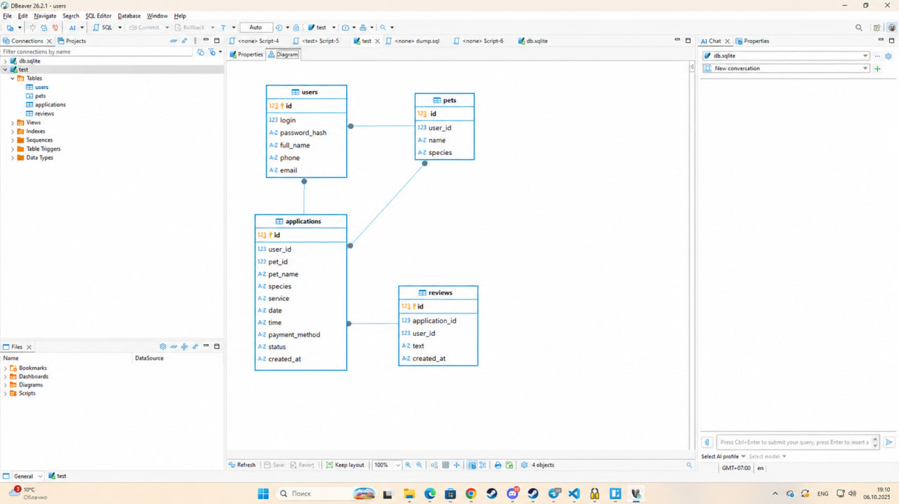
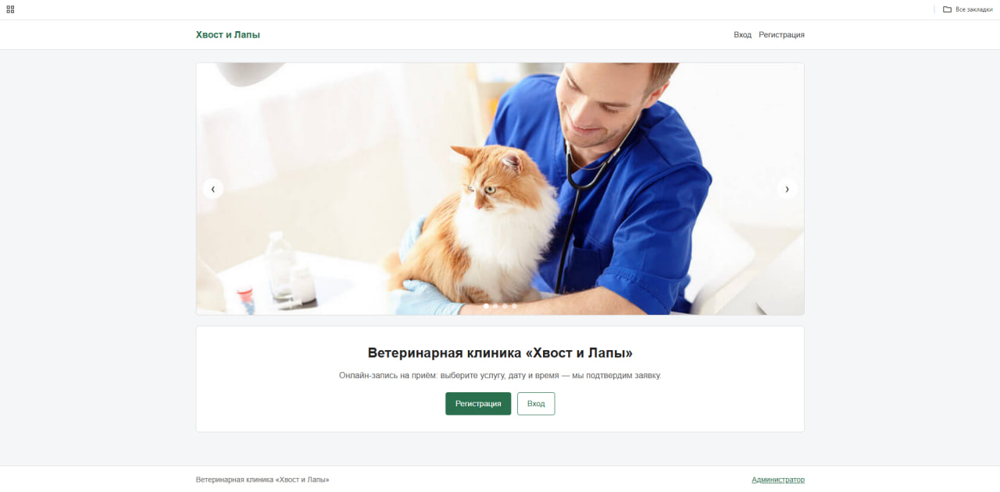
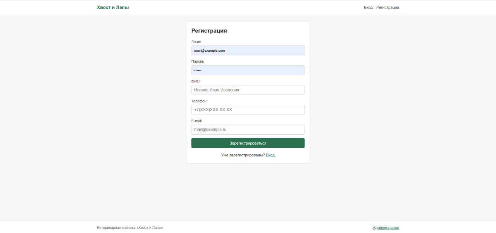
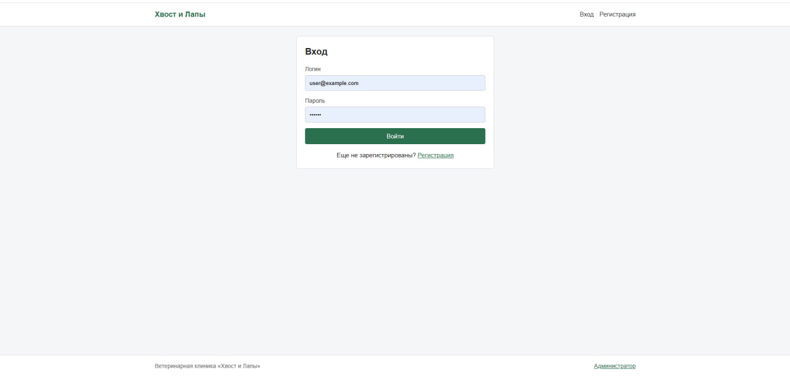
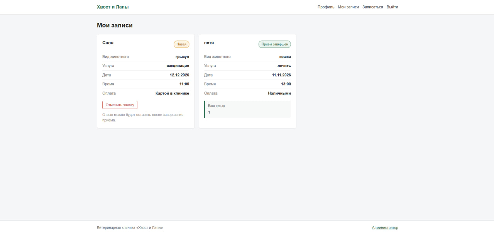
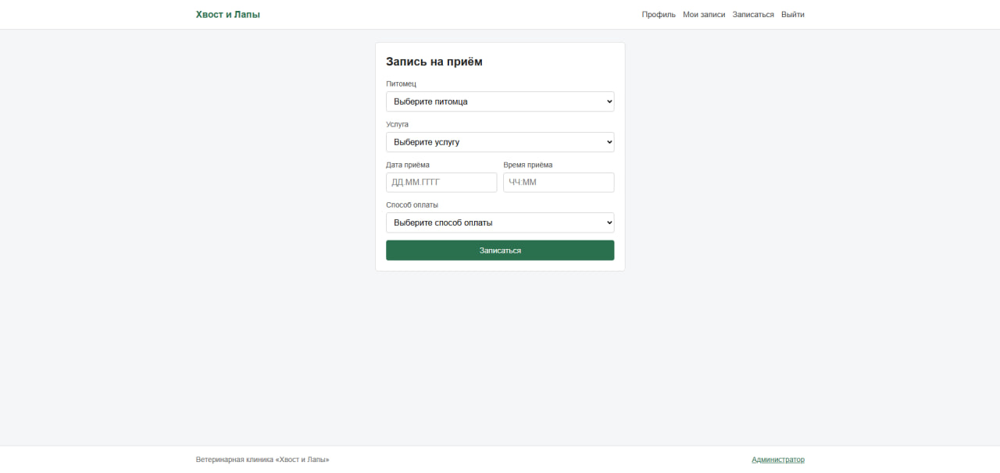
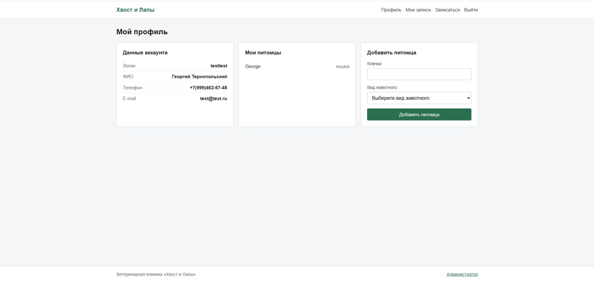
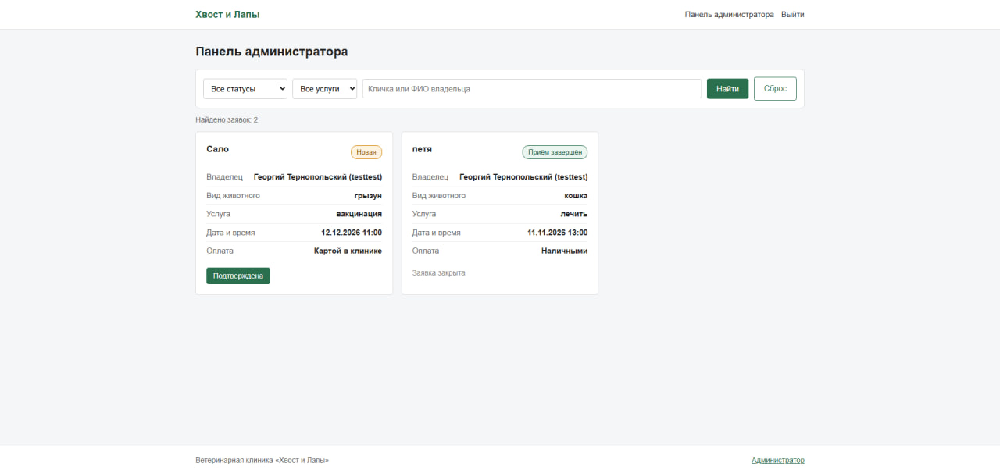

# «Хвост и Лапы» — портал записи на приём в ветеринарную клинику

Информационная система онлайн-записи к ветеринару: владельцы питомцев регистрируются, добавляют питомцев и оформляют заявки на приём, администратор клиники подтверждает записи, отмечает завершённые приёмы и работает с отзывами.

---

## Технологии

| Компонент | Технология |
|---|---|
| Бэкенд | PHP 8 (ООП: классы, статические методы, автозагрузка) |
| База данных | SQLite через PDO (подготовленные выражения, внешние ключи, индексы) |
| Фронтенд | HTML, CSS, JavaScript (без фреймворков) |
| Форматы | JSON-совместимые сессии, flash-сообщения и всплывающие тосты |
| Внешние зависимости | Отсутствуют — приложение полностью работает без интернета |

---

## Структура проекта

```
project/
├── index.php                  — главная страница, слайдер
├── frontend/                  — страницы и их оформление
│   ├── login.php              — авторизация
│   ├── register.php           — регистрация
│   ├── applications.php       — мои заявки + отзывы + отмена
│   ├── application_create.php — формирование заявки
│   ├── profile.php            — профиль: данные аккаунта и питомцы
│   ├── admin.php              — панель администратора
│   ├── partials/              — шапка (меню, уведомления) и подвал
│   └── assets/                — css, js, изображения
└── backend/                   — логика без HTML-разметки
    ├── config.php             — подключение к БД, учётка администратора
    ├── bootstrap.php          — сессия, автозагрузка классов, хелперы
    ├── classes/               — Database, Validator, Auth, User,
    │                            Application, Review, Pet
    ├── actions/               — обработчики форм (POST → redirect)
    └── database/              — dump.sql, ER-диаграмма
```

---

## Запуск

Из корня проекта:

```
php -S localhost:8000
```

Затем открыть в браузере `http://localhost:8000`.

- База данных SQLite создаётся и заполняется автоматически при первом обращении — прогонять дамп вручную не нужно.
- Вход администратора: логин `Admin`, пароль `VetLapa1` (панель — ссылкой «Администратор» в подвале или в шапке после входа).

---

## Основной функциональный функционал

**Владелец питомца**

- Регистрация с валидацией: логин (латиница и цифры, от 6 символов, уникальный), пароль, ФИО (кириллица), телефон `+7(XXX)XXX-XX-XX`, e-mail. Ошибки выводятся под полями, введённые значения сохраняются.
- Авторизация с сообщением об ошибке при неверных данных.
- Профиль: данные аккаунта, список питомцов и добавление нового питомца (кличка + вид из списка).
- Запись на приём: выбор питомца из списка, услуга из списка, дата `ДД.ММ.ГГГГ`, время `ЧЧ:ММ` (клиника работает с 09:00 до 20:00 — проверяется на клиенте и на сервере), способ оплаты.
- Свои заявки: питомец, услуга, дата, статус; отмена заявки со статусом «Новая»; отзыв — только после статуса «Приём завершён» (проверка на сервере).

**Администратор**

- Вход по логину и паролю; обычный пользователь в панель не попадает.
- Все заявки пользователей с владельцем и питомцем.
- Переходы статусов строго по схеме:

```
Новая ──────────► Подтверждена ──────────► Приём завершён
                      │
                      └──────────────────► Отменена
```

- Фильтр по статусу и услуге, поиск по кличке или ФИО владельца, пагинация по 5 заявок, всплывающие уведомления об изменениях.

---

## Как разрабатывались модули

### Модуль 1. Проектирование и разработка информационных систем

Спроектирована база данных (`users`, `applications`, `reviews`) с внешними ключами и справочными значениями, подготовлен дамп и ER-диаграмма. Разработано ядро приложения: классы-обёртка над PDO, валидатор полей, авторизация с ролями, обработчики форм по схеме «POST → редирект». Реализованы страницы регистрации, авторизации, просмотра и формирования заявок, панель администратора со сменой статусов. Интерфейс — максимально простой, без оформления, чтобы была возможность перенести его в макет.

### Модуль 2. Разработка дизайна веб-приложений

Подготовлены и оптимизированы изображения (одинаковый размер 1200×500, JPEG). На главной странице размещён слайдер из 4 фотографий с автоматической сменой каждые 3 секунды и кнопками «вперёд/назад». Регистрация получила кнопку «Зарегистрироваться». Вид животного и услуга переведены на списки выбора, введены форматы даты и времени. Отзыв разрешён только при статусе «Приём завершён». Панель администратора дополнена фильтрами, поиском и пагинацией, статичные сообщения заменены на всплывающие тосты. Вёрстка адаптирована под смартфон 390×844.

### Модуль 3. Проектирование, разработка и оптимизация веб-приложений

База данных доработана: питомцы вынесены в отдельную таблицу со связью «пользователь — питомец — заявка», добавлены индексы и включена проверка внешних ключей; существующие данные мигрируются автоматически. В профиле появилось добавление питомцев, а при записи питомец выбирается из списка. Время приёма проверяется на попадание в рабочие часы на клиенте и на сервере. Пользователь может отменить свою заявку со статусом «Новая». Добавлены анимации: плавное появление карточек заявок, подсветка карточки при смене статуса, микроанимации кнопок и полей, выезжающие уведомления. Адаптивный дизайн доведён до брейкпоинтов 390 / 768 / 1280 px, код сведён к общим классам без дублирования.

---

## ER-диаграмма



---

## Скриншоты

### Главная страница со слайдером



### Регистрация



### Авторизация



### Мои записи



### Формирование заявки



### Мой профиль



### Панель администратора


